# 🎒 Arah Utara 

adalah aplikasi Android yang dibuat untuk mendukung pengelolaan usaha rental perlengkapan outdoor seperti camping dan hiking secara lebih efisien dan modern.
Memiliki tampilan minimalis dark mode dengan fitur transaksi, data barang, pelanggan, dan laporan.

## ⛺ Fitur Utama
🛒 Transaksi Sewa & Beli
👥 Manajemen Pelanggan
📦 Data Peralatan Outdoor
🏕️ Kategori Peralatan
👨‍💼 Manajemen Pegawai
🧾 Laporan Pendapatan
🏪 Multi Cabang
🖨️ Pengaturan Printer
🌙 Modern Dark Mode UI

##📱 Tampilan Aplikasi

Dashboard utama menampilkan:

Estimasi pendapatan harian
Shortcut transaksi cepat
Menu utama
Statistik sederhana usaha outdoor

# 📸 Screenshot

## Halaman Register
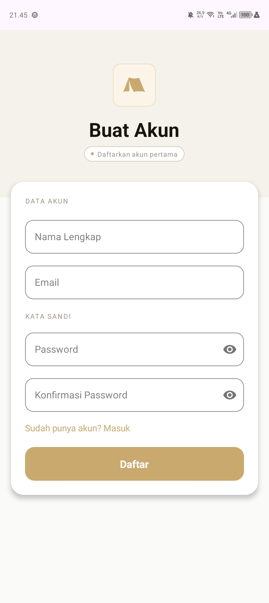
## Login
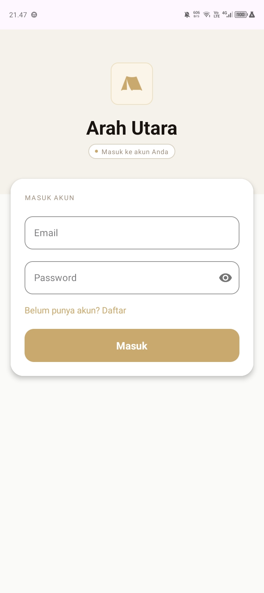
## Halaman Utama
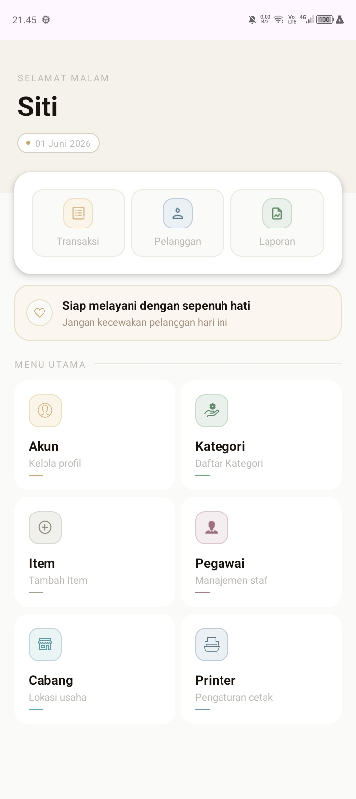
## Akun
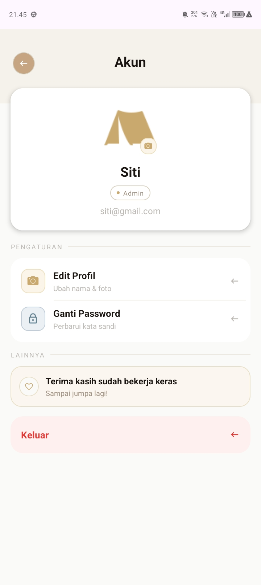
## Kategori
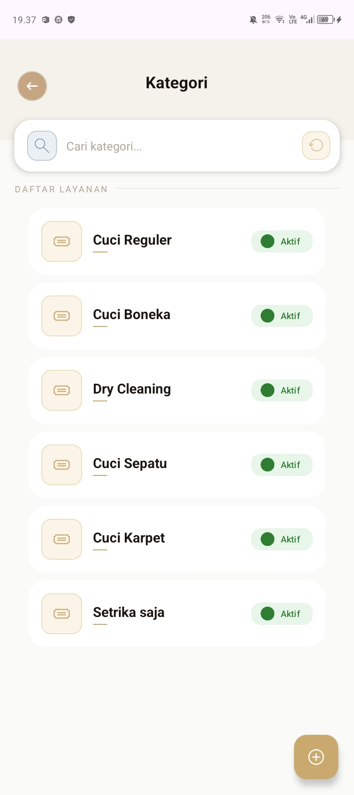
## Tambah Kategori
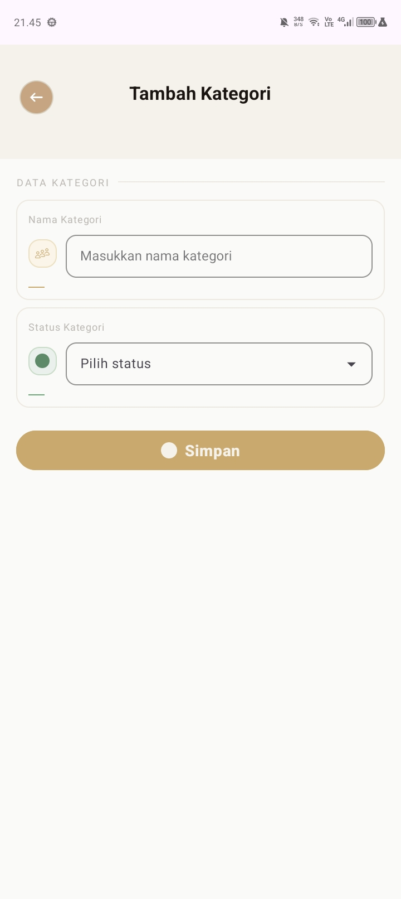
## Item
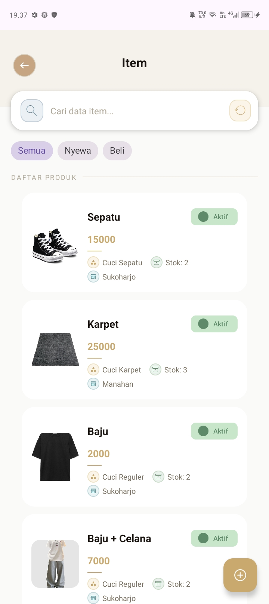
## Tambah Item
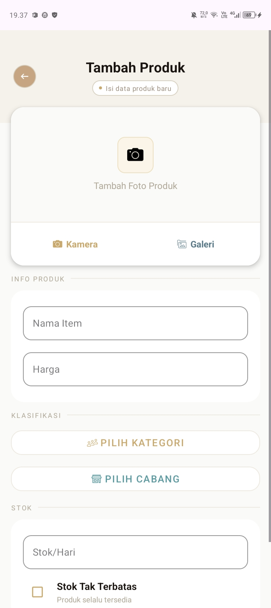
## Pegawai
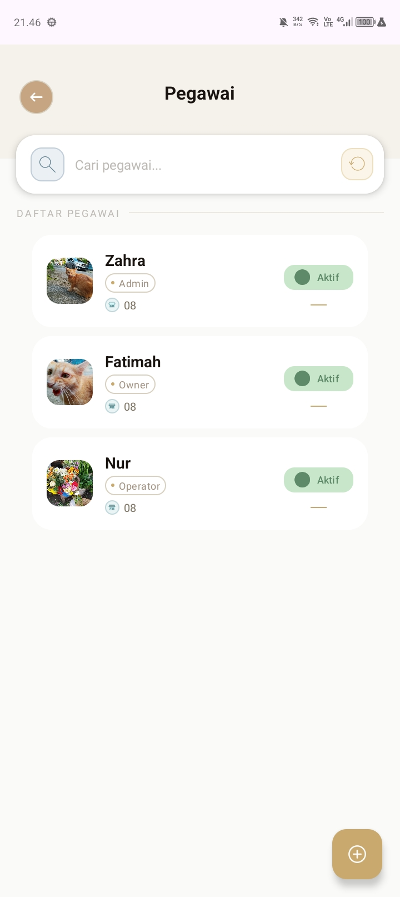
## Tambah Pegawai
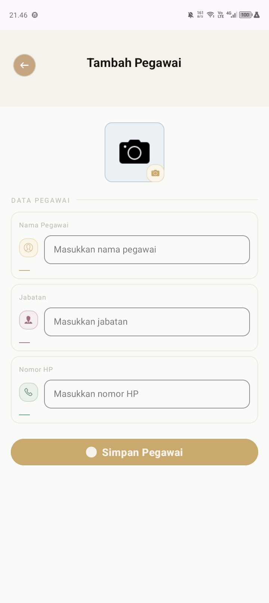
## Cabang
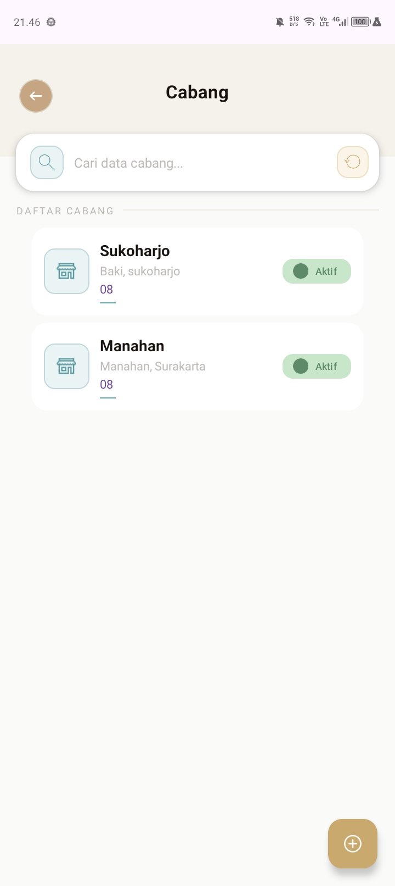
## Tambah Cabang
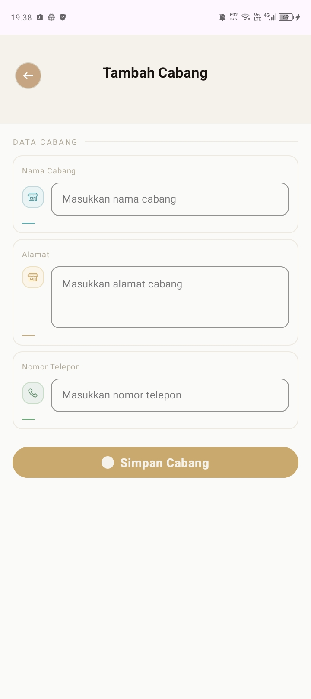
## Printer
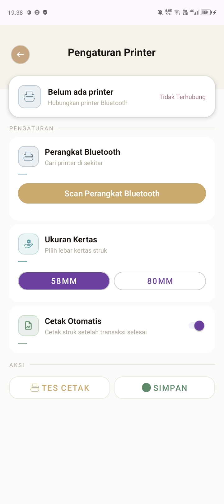
## Transaksi
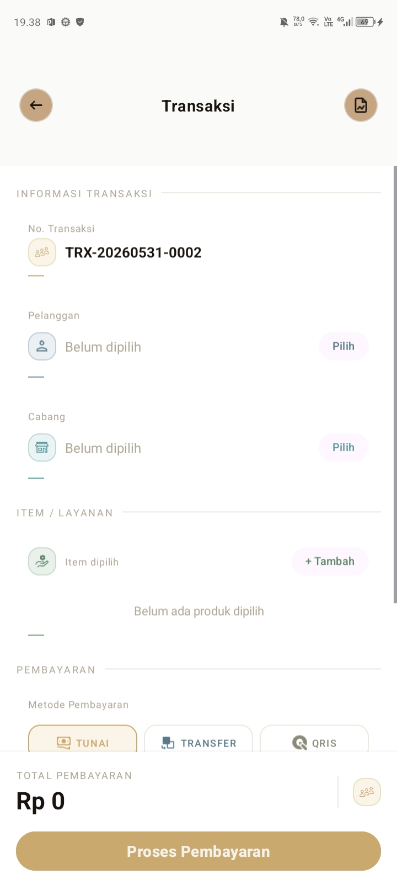
## Struk
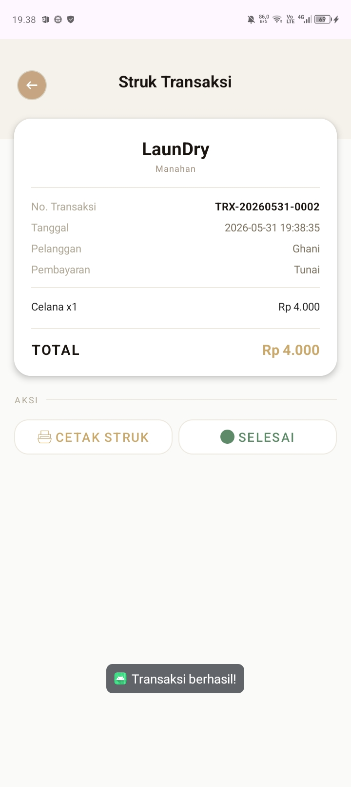
## Pelanggan
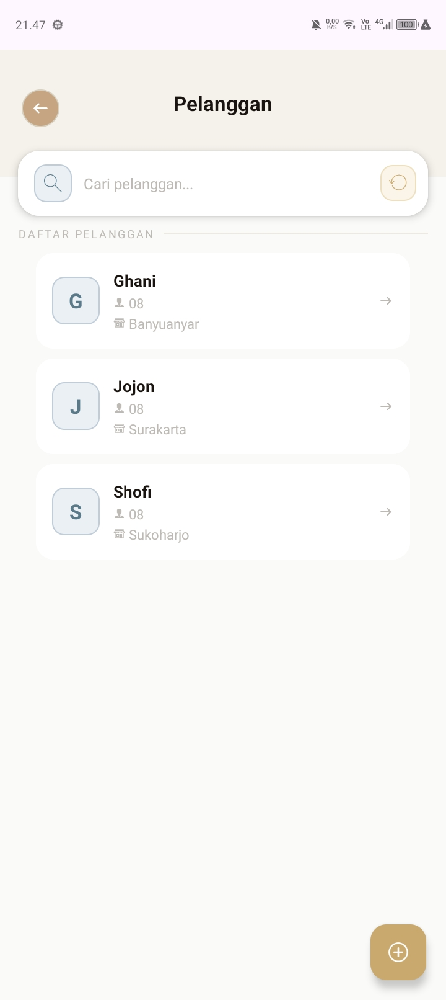
## Tambah Pelanggan
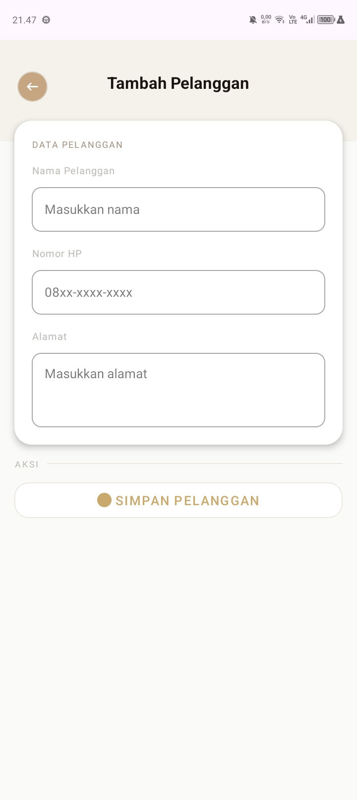
## Laporan
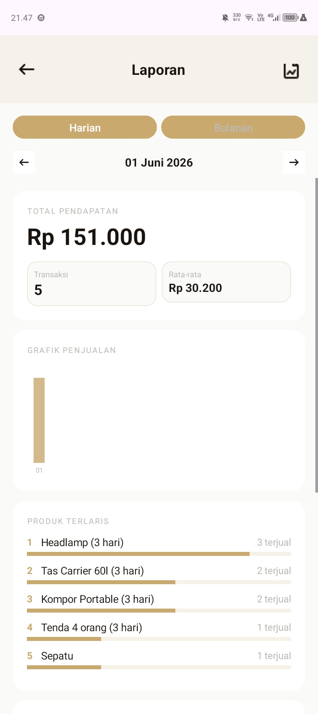

